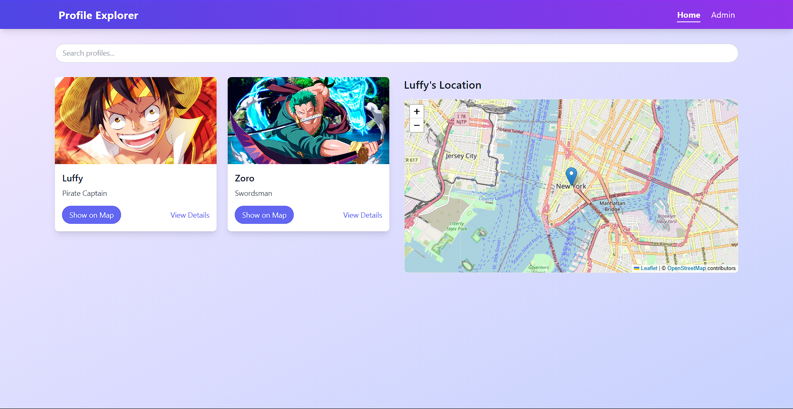
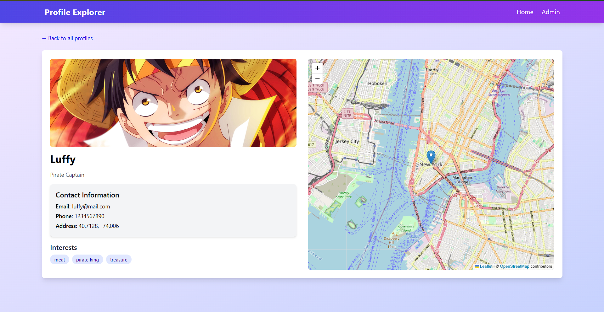
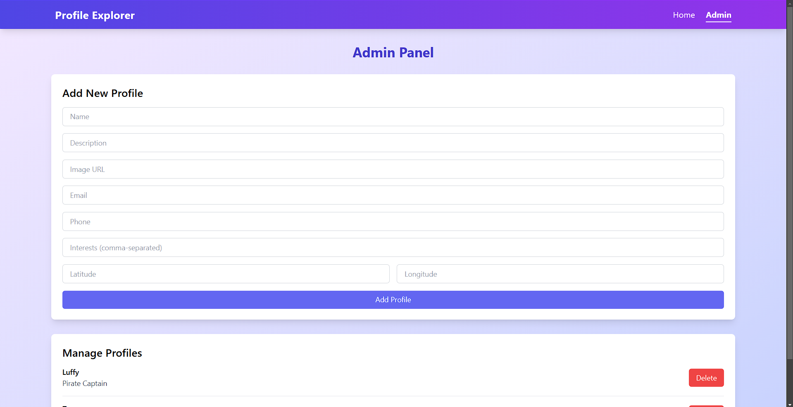

# Profile Explorer Application

A React-based web application for managing and viewing user profiles with interactive map integration.  
**[View the live demo](https://profileexplorer.netlify.app)**

## Features

- 📋 **View and manage user profiles**
- 🗺️ **Interactive map integration** with OpenStreetMap
- 🔍 **Search and filter profiles** for quick navigation
- ✏️ **Admin panel** for managing user profiles
- 📱 **Responsive design** optimized for all devices
- 🎯 **Location-based profile visualization**
- 🖼️ **Detailed profile view** with image support

## Screenshots

### Homepage



### Profile View



### Admin Page



## Installation

1. Clone the repository:
   ```bash
   git clone https://github.com/hari-bot/bynry-assignment.git
   ```
2. Navigate to the project directory:
   ```bash
   cd bynry-assignment
   ```
3. Install dependencies:
   ```bash
   npm install
   ```
4. Start the development server:
   ```bash
   npm start
   ```
5. Open [http://localhost:3000](http://localhost:3000) to view the application in your browser.

## Technologies Used

- **React.js** for building the user interface
- **React Router DOM** for navigation and routing
- **Leaflet Maps** for interactive map functionality
- **Tailwind CSS** for responsive and modern styling
